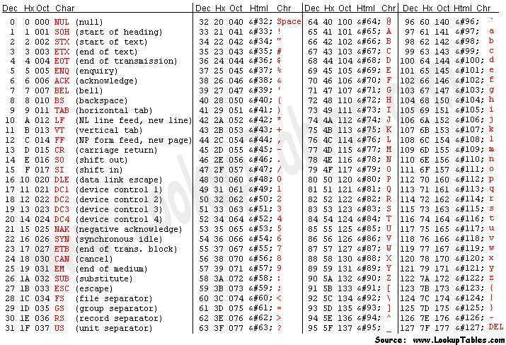

# FUNDAMENTALS IN PROGRAMMING

 

By CodeBlocks

 

### 1. INTRODUCTION TO C PROGRAMMING

This course, we are going to learn about C programming. So, we are going to pull up to our GitHub some practical exercises for our improvement, our skills and our knowledge. I hope that it is a great subject. Learn is always good.

### 2. PRACTICAL EXERCISES
 

### - Exercises 1:
    
1. Hello World (**done**) => its own C code is in the folder Exercise1 > 1HelloWorld.
2. Print Integer (**done**) => its own C code is in the folder Exercise1 > 2Print_Integer.
3. Print Three Integers (**done**) => its own C code is in the folder Exercise1 > 3Print_Three_Integers.
4. Read Integer (**done**) => its own C code is in the folder Exercise1 > 4Read_Integer.
5. Read Two Integers (**done**) => its own C code is in the folder Exercise1 > 5Read_Two_Integers.
6. Your Year (**done**) => its own C code is in the folder Exercise1 > 6Your_Year.
7. Other Years (**done**) => its own C code is in the folder Exercise1 > 7Other_Years.
8. Swap Digits (**done**) => its own C code is in the folder Exercise1 > 8Swap_Digits => 
9. Complex numbers (**done**) => its own C code is in the folder Exercise1 > 9Complex_numbers.
10. Photo Store (**done**) => its own C code is in the folder Exercise1 > 10Photo_Store => 
11. Food for a cat (**done**) => its own C code is in the folder Exercise1 > 11Food_for_cat => 
- The statement of the Exercise 1 is in the folder Exercise1 > PDF.

### - Exercises 2:
    
1. Practice 2.1 (**done**) => its own C code is in the folder Exercise2 > Practice2_1.
2. Practice 2.2 (**done**) => its own C code is in the folder Exercise2 > Practice2_2.
3. Practice 2.3 (**done**) => its own C code is in the folder Exercise2 > Practice2_3.
4. Practice 2.4 (**done**) => its own C code is in the folder Exercise2 > Practice2_4.
5. Practice 2.5 (**done**) => its own C code is in the folder Exercise2 > Practice2_5.
6. Practice 2.6 (**done**) => its own C code is in the folder Exercise2 > Practice2_6.
7. Practice 2.7 (**done**) => its own C code is in the folder Exercise2 > Practice2_7.
8. Practice 2.8 (**done**) => its own C code is in the folder Exercise2 > Practice2_8.
9. Practice 2.9 (**done**) => its own C code is in the folder Exercise2 > Practice2_9.
10. Practice 2.10 (**done**) => its own C code is in the folder Exercise2 > Practice2_10.
11. Practice 2.11 (**done**) => its own C code is in the folder Exercise2 > Practice2_11.
12. Practice 2.12 (**done**) => its own C code is in the folder Exercise2 > Practice2_12.
13. Practice 2.13 (**done**) => its own C code is in the folder Exercise2 > Practice2_13.
14. Practice 2.14 (**done**) => its own C code is in the folder Exercise2 > Practice2_14.
15. Practice 2.15 (**done**) => its own C code is in the folder Exercise2 > Practice2_15.
16. Practice 2.16 (**done**) => its own C code is in the folder Exercise2 > Practice2_16.
- The statement of the Exercise 2 is in the folder Exercise2 > PDF.

- Important image about the ASCII Table => 

### - Exercises 3:
    
1. Practice 3.1 (**done**) => its own C code is in the folder Exercise3 > Practice3_1.
2. Practice 3.2 (**done**) => its own C code is in the folder Exercise3 > Practice3_2.
3. Practice 3.3 (**done**) => its own C code is in the folder Exercise3 > Practice3_3.
4. Practice 3.4 (**done**) => its own C code is in the folder Exercise3 > Practice3_4.
5. Practice 3.5 (**done**) => its own C code is in the folder Exercise3 > Practice3_5.
6. Practice 3.6 (**done**) => its own C code is in the folder Exercise3 > Practice3_6.
7. Practice 3.7 (**done**) => its own C code is in the folder Exercise3 > Practice3_7.
8. Practice 3.8 (**done**) => its own C code is in the folder Exercise3 > Practice3_8.
9. Practice 3.9 (**done**) => its own C code is in the folder Exercise3 > Practice3_9.
- The statement of the Exercise 3 is in the folder Exercise3 > PDF.

### - Exercises 4:
    
1. Practice 4.1 (**done**) => its own C code is in the folder Exercise4 > Practice4_1.
2. Practice 4.2 (**done**) => its own C code is in the folder Exercise4 > Practice4_2.
3. Practice 4.3 (**done**) => its own C code is in the folder Exercise4 > Practice4_3.
4. Practice 4.4 (**done**) => its own C code is in the folder Exercise4 > Practice4_4.
5. Practice 4.5 (**done**) => its own C code is in the folder Exercise4 > Practice4_5.
6. Practice 4.6 (**done**) => its own C code is in the folder Exercise4 > Practice4_6.
7. Practice 4.7 (**done**) => its own C code is in the folder Exercise4 > Practice4_7.
8. Practice 4.8 (**done**) => its own C code is in the folder Exercise4 > Practice4_8.
- The statement of the Exercise 4 is in the folder Exercise4 > PDF.

### - Exercises 5:
    
1. Practice 5.1 (**done**) => its own C code is in the folder Exercise5 > Practice5_1.
2. Practice 5.2 (**done**) => its own C code is in the folder Exercise5 > Practice5_2.
3. Practice 5.3 (**done**) => its own C code is in the folder Exercise5 > Practice5_3.
4. Practice 5.4 (**done**) => its own C code is in the folder Exercise5 > Practice5_4.
5. Practice 5.5 (**done**) => its own C code is in the folder Exercise5 > Practice5_5.
6. Practice 5.6 (**done**) => its own C code is in the folder Exercise5 > Practice5_6.
7. Practice 5.7 (**done**) => its own C code is in the folder Exercise5 > Practice5_7.
8. Practice 5.8 (**done**) => its own C code is in the folder Exercise5 > Practice5_8.
9. Practice 5.9 (**done**) => its own C code is in the folder Exercise5 > Practice5_9.
10. Practice 5.10 (**done**) => its own C code is in the folder Exercise5 > Practice5_10.
11. Practice 5.11 (**done**) => its own C code is in the folder Exercise5 > Practice5_11.
12. Practice 5.12 (**done**) => its own C code is in the folder Exercise5 > Practice5_12.
13. Practice 5.13 (**done**) => its own C code is in the folder Exercise5 > Practice5_13.
14. Practice 5.14 (**done**) => its own C code is in the folder Exercise5 > Practice5_14.
15. Practice 5.15 (**done**) => its own C code is in the folder Exercise5 > Practice5_15.
- The statement of the Exercise 5 is in the folder Exercise5 > PDF.

### - Exercises 6:
    
1. Practice 6.1 (**done**) => its own C code is in the folder Exercise6 > Practice6_1.
- The statement of the Exercise 6 is in the folder Exercise6 > PDF.

### - Exercises 7:
    
1. Practice 7.1 (**done**) => its own C code is in the folder Exercise7 > Practice7_1.
2. Practice 7.2 (**done**) => its own C code is in the folder Exercise7 > Practice7_2.
3. Practice 7.3 (**done**) => its own C code is in the folder Exercise7 > Practice7_3.
4. Practice 7.4 (**done**) => its own C code is in the folder Exercise7 > Practice7_4.
5. Practice 7.5 (**done**) => its own C code is in the folder Exercise7 > Practice7_5.
6. Practice 7.6 (**done**) => its own C code is in the folder Exercise7 > Practice7_6.
7. Practice 7.7 (**done**) => its own C code is in the folder Exercise7 > Practice7_7.
- The statement of the Exercise 7 is in the folder Exercise7 > PDF.

### - Exercises 8:
    
1. Practice 8.1 (**done**) => its own C code is in the folder Exercise8 > Practice8_1.
- The statement of the Exercise 8 is in the folder Exercise8 > PDF.

### - Exercises 9:
    
1. Practice 9.1 => its own C code is in the folder Exercise9 > Practice9_1.
- The statement of the Exercise 9 is in the folder Exercise9 > PDF.

 

PS: The photos are editted by Adobe Photoshop.