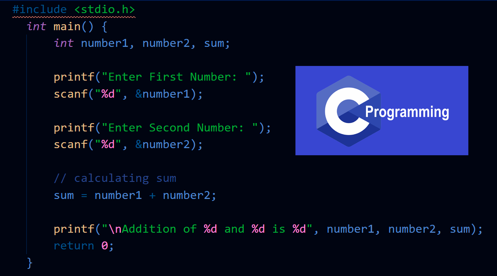
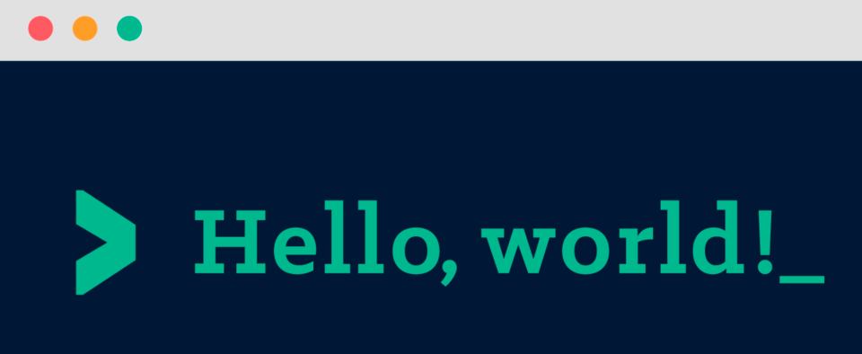
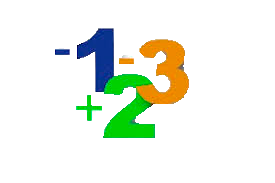
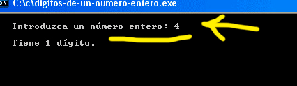
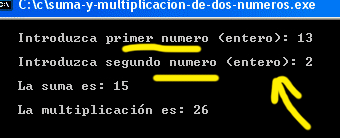
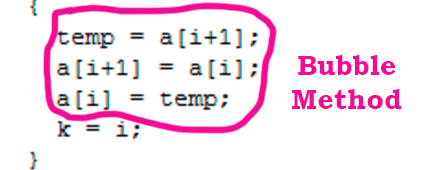

# FUNDAMENTALS IN PROGRAMMING

 

 

### 1. INTRODUCTION TO C PROGRAMMING

This course, we are going to learn about C programming. So, we are going to pull up to our GitHub some practical exercises for our improvement, our skills and our knowledge. I hope that it is a great subject. Learn is always good.

### 2. PRACTICAL EXERCISES

 

Exercises 1:
    
1. Hello World => its own C code => 
2. Print Integer => its own C code => 
3. Print Three Integers => its own C code => 
4. Read Integer => its own C code => 
5. Read Two Integers => its own C code => 
6. Your Year => its own C code => 
7. Other Years => its own C code => 
8. Swap Digits => its own C code => 
9. Complex numbers => its own C code => 
10. Photo Store => its own C code => 
11. Food for a cat => its own C code => 

PS: The photos are editted by Adobe Photoshop.